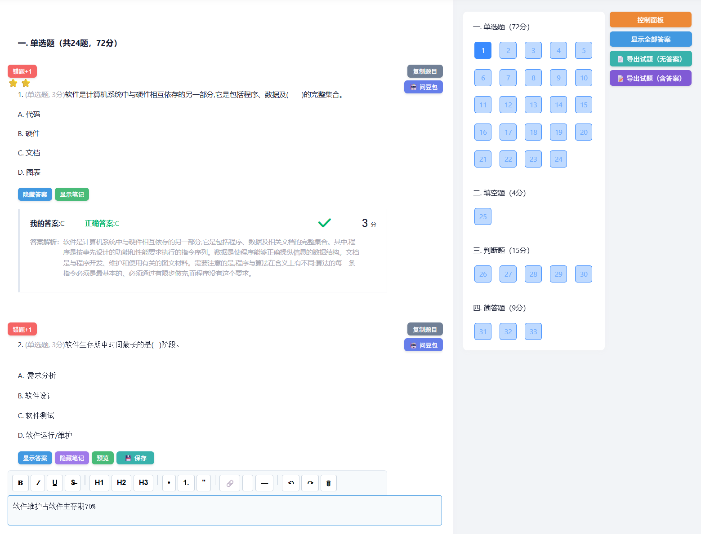
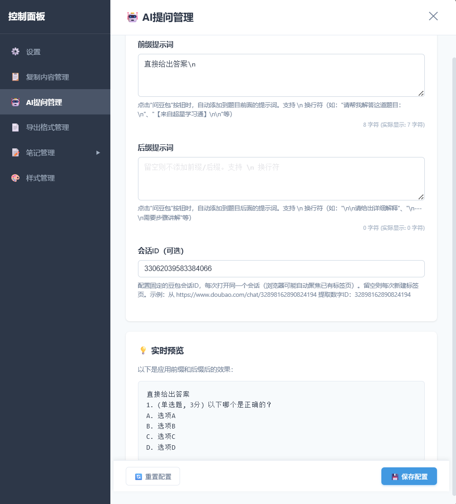

# 超星学习通高效刷题小助手

提升超星学习通刷题效率的强大工具！支持**答案自由控制**（单个/全局）、**一键问豆包AI**（智能跨域提问）、**富文本笔记**、**完整样式自定义**、**试题导出为Word文档**，让你在作业练习中更专注、更高效。

## ✨ v3.8.1 功能优化

### 🤖 AI提问管理 - 配置灵活化
- **移除默认前缀**：默认传送完整题目，无额外内容
- **AI提问管理选项卡**：在控制面板新增"🤖 AI提问管理"选项卡
- **前后缀配置**：支持自定义AI提问前缀/后缀提示词（如："请帮我解答：\n"、"\n\n需要详细步骤"）
- **实时预览**：配置面板中提供完整的效果预览，所见即所得
- **标签页复用**：智能检测已关闭的对话窗口，自动复用已有标签页（聚焦+刷新）
- **代码复用优化**：提取通用的前后缀配置面板方法，复制配置和AI提问配置共享UI逻辑

## ✨ v3.8.0 重磅更新

### 🤖 一键问豆包AI - 全新功能
- **智能提问按钮**：在每道题目右上角新增"🤖 问豆包"按钮，紧贴复制按钮下方
- **跨域自动交互**：点击按钮自动打开豆包AI，题目内容自动填充到输入框
- **自动发送**：题目填充后自动点击发送按钮，无需手动操作
- **会话复用**：智能检测已有对话窗口，优先复用而非新建
- **GM存储技术**：使用 `GM_setValue/GM_getValue` 实现超星与豆包页面的跨域数据传递
- **无缝体验**：新标签页自动切换，提问过程一气呵成

### 📋 复制功能增强（v2.7.16）
- **图片复制支持**：复制题目时自动包含图片，粘贴到 Word 时保留图片
- **富文本格式**：使用 HTML 格式复制，保留题目的原始排版和图片
- **智能降级**：如果浏览器不支持 HTML 复制，自动降级到纯文本复制
- **ClipboardItem API**：使用现代剪贴板 API，支持同时复制文本和 HTML 格式

### 🎨 固定下边栏优化（v2.7.16）
- **完全固定**：下边栏固定在控制面板窗口底部，不随内容滚动
- **左右延伸**：下边栏左右延伸到窗口边缘，无间隙
- **统一样式**：所有设置面板（基础设置、复制配置、导出设置、样式管理）统一使用固定下边栏
- **更好的视觉效果**：下边栏与内容区域无缝连接，更加美观

### 🧹 代码重构与优化（v2.7.15）
- **新增 UI 组件工厂方法**：在 DOMHelper 中添加 `createCard`、`createTitle`、`createDescription`、`createButton` 等通用方法
- **代码复用优化**：重构控制面板中的重复容器创建代码，减少约 200+ 行重复代码
- **提升可维护性**：统一的组件创建接口，便于后续功能扩展
- **改进代码结构**：更清晰的组件分层，符合高可维护和高可扩展原则

### 🐛 保存按钮修复（v2.7.14）
- **修复保存按钮缺失**：修正方法名错误（`_createActionBar` → `_createFloatingActionBar`）
- **保存按钮现已显示**：底部操作栏正常显示保存和重置按钮
- **配置持久化修复**：点击保存按钮后配置正确写入 IndexedDB

### 🐛 复制配置功能修复（v2.7.13）
- **修复换行符**：修复复制时 `\n` 转义符不生效的问题
- **保存功能**：添加保存配置按钮，手动保存前缀/后缀配置
- **UI 优化**：移除冗余的功能说明区域，界面更简洁
- **重置功能**：支持一键重置复制配置到默认状态

### 📋 复制内容前后缀管理（v2.7.12）
- **独立配置面板**：将复制配置从设置中独立出来，单独成为"复制配置"选项卡
- **多行文本输入**：使用 textarea 支持多行前缀/后缀输入
- **换行符支持**：支持使用 `\n` 表示换行符，实时预览中自动转换显示
- **字符计数**：显示输入字符数和实际显示字符数（转义后）
- **实时预览**：配置面板中提供完整的效果预览，所见即所得
- **配置持久化**：前缀和后缀配置自动保存到 IndexedDB

### 📋 复制配置功能（v2.7.11）
- **前缀配置**：为复制的题目内容添加自定义前缀（如："【题目】"、"问："等）
- **后缀配置**：为复制的题目内容添加自定义后缀（如："\n---"、"\n来源：超星学习通"等）
- **实时预览**：配置面板中提供实时效果预览
- **配置持久化**：前缀和后缀配置自动保存到 IndexedDB
- **灵活自定义**：支持留空不添加前缀/后缀

### 🐛 响应式布局修复（v2.7.10）
- **修复按钮横向排列问题**：下方布局时始终保持纵向排列（从上到下）
- **修复空间检测误判**：增加安全边距，防止按钮在某些分辨率下被截断
- **优化空间计算**：从 150px 提升到 170px（含20px安全边距）
- **添加调试日志**：便于排查不同分辨率下的布局问题
- **优化按钮对齐**：下方布局时使用 `stretch` 确保按钮占满宽度

### 📱 智能响应式布局优化（v2.7.9）
- **智能空间检测**：自动检测右侧空间是否足够显示按钮
- **动态布局切换**：右侧空间不足时自动移至下方，保持纵向排列
- **平滑过渡效果**：布局切换时添加 0.3s 平滑动画
- **ResizeObserver 监听**：精确响应侧边栏大小变化

### 📄 导出功能增强（v2.7.4）
- **真正的 docx 格式**：集成 html-docx-js 库，优先导出为 .docx 文件
- **智能降级**：库不可用时自动回退到 .doc 格式
- **更清晰的分割线**：题目之间的分割线更加明显（3px深灰色粗线）
- **防止分页截断**：打印时题目不会被分页截断

### 📋 导出内容可选（v2.7.3）
- **我的答案**：控制是否导出考生作答结果
- **正确答案**：控制是否导出正确答案信息
- **本题得分**：控制是否导出得分信息
- **答案解析**：控制是否导出答案解析内容
- 所有选项可在控制面板的导出设置中配置

### 🔧 界面优化（v2.7.0-v2.7.2）
- **双按钮导出**：「📄 导出试题」和「📝 导出答案」一目了然
- **笔记排序增强**：时间排序和字母排序各独立按钮，支持升降序切换
- **统一浮动操作栏**：所有设置面板底部操作栏样式统一

---

## 🖼️ 预览图

---

## 🧩 安装方式

> 🌟 每次打开作业页面自动运行，支持答案自由控制、富文本笔记、样式自定义，让刷题学习更高效！

### 方式一：从 Greasy Fork 安装（推荐）

1. 安装浏览器插件 [Tampermonkey（油猴）](https://www.tampermonkey.net/)  
2. 点击以下链接安装脚本：  
   👉 [**超星学习通高效刷题小助手 - Greasy Fork**](https://greasyfork.org/zh-CN/scripts/555192)
3. 进入超星作业页面，脚本会自动运行

### 方式二：直接安装脚本

1. 确保已安装 [Tampermonkey](https://www.tampermonkey.net/)
2. 点击以下链接直接安装：  
   👉 [**直接安装脚本**](https://update.greasyfork.org/scripts/555192/超星学习通高效刷题小助手.user.js)

---

## 📦 核心功能

### 🎯 答案控制
- **单个控制**：每道题目独立的显示/隐藏按钮
- **全局控制**：一键显示/隐藏所有答案

### 🤖 智能AI助手
- **一键问豆包**：点击"🤖 问豆包"按钮，自动提取题目内容
- **跨域提问**：自动打开豆包AI并填充题目到输入框
- **自动发送**：题目填充后自动点击发送，无需手动操作
- **会话复用**：智能检测已有对话窗口，优先复用

### 📋 题目复制
- **一键复制**：每道题目独立的复制按钮，支持图片复制
- **富文本格式**：使用 HTML 格式复制，保留排版和图片
- **前缀配置**：自定义复制内容的前缀（默认无）
- **后缀配置**：自定义复制内容的后缀（默认无）
- **实时预览**：设置面板中查看配置效果

### 📝 富文本笔记
- **16 个格式按钮**：粗体、斜体、下划线、删除线、标题(H1-H3)、有序/无序列表、引用、链接、代码、分隔线、撤销/重做、清除格式
- **编辑/预览模式**：支持预览格式化笔记内容
- **自动保存**：输入停止后自动保存（可配置）

### 📄 试题导出
- **双按钮导出**：无答案/含答案一键导出
- **真正的 docx**：优先使用 html-docx-js 生成标准 docx
- **多题型支持**：单选题、多选题、完型填空等
- **图片处理**：自动下载嵌入，超宽自动缩放
- **内容可选**：我的答案、正确答案、得分、解析可独立开关

### 🎨 样式自定义
- **6 按钮管理**：答案、笔记、编辑、保存、全局、控制面板按钮样式统一管理
- **完整配置**：位置、尺寸、颜色、悬停效果等 10+ 配置项
- **持久化存储**：样式配置保存到 IndexedDB

---

## 📜 更新日志

### v3.8.0 (2025-12-08) 🎉 重磅更新
- 🤖 **一键问豆包AI**：新增"🤖 问豆包"按钮，自动提取题目内容并跨域提问
- 🔗 **智能跨域交互**：使用 GM_setValue/GM_getValue 实现超星与豆包页面的数据传递
- 🚀 **自动填充发送**：豆包页面自动填充题目到输入框并自动发送
- 🎯 **会话复用优化**：智能检测已有对话，优先复用而非新建
- 🌐 **多域名支持**：脚本同时支持超星学习通和豆包AI两个域名
- ⚡ **无缝体验**：新标签页自动切换，2秒内完成题目提交

### v2.7.16 (2025-12-08)
- 📋 **图片复制支持**：复制题目时自动包含图片，支持粘贴到 Word
- 🎨 **HTML 格式复制**：使用 ClipboardItem API 复制富文本格式，保留原始排版
- 🔄 **智能降级**：如果浏览器不支持 HTML 复制，自动降级到纯文本复制
- 🎯 **固定下边栏**：下边栏紧贴窗口底部，左右延伸无间隙
- 🧹 **统一样式**：所有设置面板（基础设置、复制配置、导出设置、样式管理）统一使用固定下边栏

### v2.7.15 (2025-12-08)
- 🧹 **代码重构**：新增 DOMHelper 通用 UI 组件工厂方法（createCard、createTitle 等）
- ♻️ **代码复用**：重构控制面板、设置面板、复制配置等模块的重复代码
- 📉 **代码精简**：减少约 200+ 行重复代码，提升可维护性
- 🏗️ **架构优化**：统一组件创建接口，符合高可扩展原则

### v2.7.14 (2025-12-08)
- 🐛 **紧急修复**：修正保存按钮方法名错误（`_createActionBar` → `_createFloatingActionBar`）
- ✅ **保存按钮已显示**：底部操作栏现在正常显示保存和重置按钮
- 💾 **配置持久化修复**：点击保存按钮后配置正确写入 IndexedDB，关闭面板不再丢失

### v2.7.13 (2025-12-08)
- 🐛 **修复换行符问题**：修复复制时 `\n` 转义符不生效的 bug
- 💾 **添加保存按钮**：新增手动保存配置功能，确保配置持久化
- 🎨 **UI 简化**：移除冗余的功能说明区域，界面更简洁
- 🔄 **重置功能**：支持一键重置复制配置到默认状态

### v2.7.12 (2025-12-08)
- 📋 **独立配置面板**：将复制配置独立成专用选项卡"复制内容前后缀管理"
- 📝 **多行输入支持**：使用 textarea 替代单行输入框，支持多行前缀/后缀
- ✨ **换行符支持**：支持 `\n` 转义符表示换行，实时预览自动转换
- 📊 **字符计数**：显示输入字符数和实际显示字符数（转义后）
- 🎨 **UI 优化**：添加功能说明、改进预览布局、增强用户体验

### v2.7.11 (2025-12-08)
- 📋 **复制配置**：支持为复制的题目内容添加自定义前缀和后缀（默认留空）
- 👀 **实时预览**：设置面板中展示前缀/后缀应用效果
- 💾 **配置持久化**：前缀和后缀自动保存到 IndexedDB

### v2.7.10 (2025-12-07)
- 🐛 **修复按钮横向排列问题**：下方布局时确保纵向排列（从上到下）
- 🐛 **修复空间检测误判**：增加20px安全边距，防止按钮被截断
- 🔧 **优化空间阈值**：从150px提升到170px，适配更多分辨率
- 📊 **添加调试日志**：输出布局检测信息，便于问题排查
- 🎯 **优化按钮对齐**：下方布局时使用stretch对齐方式

### v2.7.9 (2025-12-07)
- 📱 **智能响应式布局**：新增右侧空间检测逻辑
- 🔄 **动态布局切换**：右侧空间不足时自动移至下方纵向排列
- ✨ **平滑过渡效果**：添加 0.3s CSS 过渡动画
- 👀 **ResizeObserver**：使用现代 API 精确监听侧边栏尺寸变化
- 🎯 **按钮间距统一**：所有内联按钮左边距统一为 5px

### v2.7.4 (2025-12-04)
- 📄 **docx 格式导出**：集成 html-docx-js 库，支持真正的 .docx 格式导出
- 🎯 **智能降级**：库不可用时自动回退到 .doc 格式
- 📏 **分割线增强**：题目分割线改为 3px 深灰色粗线，更加清晰
- 🖨️ **打印优化**：添加 page-break-inside: avoid 防止题目被分页截断

### v2.7.3 (2025-12-04)
- ✅ **导出内容选项**：新增 4 个勾选项控制导出内容
  - 导出"我的答案"
  - 导出"正确答案"
  - 导出"本题得分"
  - 导出"答案解析"
- 💾 **设置持久化**：导出内容选项保存到 IndexedDB

### v2.7.2 (2025-12-04)
- 🔧 **修复悬浮栏溢出**：修复底部操作栏导致保存按钮超出窗口的问题
- 🔄 **按钮位置调整**：交换控制面板和显示全部答案按钮位置
- 📊 **排序按钮拆分**：时间排序和字母排序各独立按钮，支持升降序

### v2.7.1 (2025-12-03)
- 📐 **尺寸调整**：缩小侧边栏按钮和浮动操作栏尺寸

### v2.7.0 (2025-12-03)
- 🎨 **统一浮动操作栏**：所有设置面板底部统一样式
- 📄 **导出按钮文字优化**：更清晰的导出按钮标识

### v2.6.6 (2025-12-03)
- 🧹 **导出答案优化**：移除冗余选项内容，只保留答案字母

### v2.6.5 (2025-12-02)
- 📄 **双按钮导出**：拆分为「导出试题」和「导出答案」两个按钮

### v2.6.4 (2025-12-02)
- 📄 **试题导出功能**：支持导出为 Word 文档
- 🖼️ **图片处理**：自动下载嵌入，超宽自动缩放

### v2.4.0 (2025-11-14)
- ✨ **富文本编辑器**：16 个格式按钮
- 🔍 **编辑/预览模式**：支持预览格式化笔记
- 🎯 **按钮样式统一**：6 个按钮样式完全统一
- 🖌️ **样式管理面板**：支持实时预览和持久化

### v2.3.0 (2025-11-13)
- 📝 **笔记管理增强**：支持多范围筛选
- 🎨 **样式管理面板**：新增样式管理选项卡
- 💾 **样式持久化**：保存到 IndexedDB

### v2.2.0 (2025-11-13)
- 🎛️ **控制面板升级**：左侧边栏设计
- ⚙️ **设置管理**：自动保存开关和延迟配置
- 📝 **笔记管理**：批量选择和删除

### v2.1.0 (2025-11-10)
- 📝 **笔记功能**：独立添加笔记，支持显示/隐藏
- 💾 **IndexedDB 存储**：笔记数据本地持久化
- 🔄 **自动保存**：可配置的自动保存

### v2.0.0 (2025-11-09)
- 🏗️ **重大重构**：面向对象设计
- 📦 **模块化架构**：多个独立模块
- 🎯 **单一职责原则**：提升可维护性

### v1.0.1
- 🧩 油猴脚本支持
- 💬 单块恢复+全局控制按钮

### v1.0.0
- 🎉 首次发布
